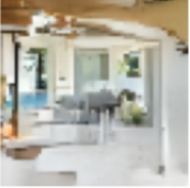

# **FurnitureGen**: AI-Powered Interior Design Generator

## Best Generated Output
Although the "best" output from my model depends slightly on your interior design taste, I especially liked this image from the 80th training epoch:

---

## Vision
For interior designers, homeowners, and decorators seeking quick and imaginative design inspiration, **FurnitureGen** is a generative AI tool that creates photorealistic images of furnished spaces and helps users shop for the items they see.

Unlike traditional interior design apps, **FurnitureGen** provides generated images *and* matches the furniture to purchasable real-world products using reverse image search. _Note: some features are still experimental_

---

## Motivation
Interior design ideation can be time-consuming, often requiring the assembly of reference photos, sample catalogs, or extensive manual design software usage. This process creates friction for both professionals and consumers looking to visualize room layouts or design styles on the fly.

With the rise of generative AI and diffusion-based models, we now have the capability to streamline this ideation process using smart tools that offer instant visual inspiration grounded in purchasable inventory.

---

## **Market Opportunity**
The U.S. home furnishing market was valued at $141.27 billion in 2024 and is expected to reach $203.16 billion by 2033, with a Compound Annual Growth Rate (CAGR) of 4.1%. Furniture is the largest segment within the market, representing 55.2% of the market share in 2024. Online stores are the leading distribution channel, accounting for 49.7% of sales in 2024 [according to Market.us.](https://market.us/report/home-furnishing-market/) **FurnitureGen** sits at the center of this rapidly growing market.

---

## Customer Personas

### Persona 1: Alex – The Interior Designer
_Note: these personas are fictional, illustrative descriptions of potential customer segments._
Alex has three client meetings coming up and wants to quickly prototype visual options for a small urban living room. Instead of mocking up scenes in SketchUp, Alex types:
> “Mid-century modern living room with a green velvet couch and walnut coffee table.”

**FurnitureGen** generates three options. Alex downloads one and shares it with the client within minutes.

### Persona 2: Jamie – The New Homeowner
Jamie just moved into a new home and wants to furnish their bedroom. They upload a picture of their empty room and type:
> “Minimalist bedroom with white oak furniture and cozy neutral tones.”

After reviewing the generation, Jamie clicks a chair they love and is directed to a similar product available online.

### Unmet Customer Needs
- Users cannot easily generate design variations based on their space and taste.
- There is no end-to-end flow from inspiration to product discovery within a generative interface.

---

## **Existing Solutions & Gaps**
| Tool             | Key Features                              | Gaps Identified                      |
|------------------|--------------------------------------------|--------------------------------------|
| Pinterest        | Visual inspiration via browsing            | Not generative, lacks personalization |
| IKEA Planner     | Interactive room builder                   | Slow, rigid, no generative power     |
| Midjourney/DALLE | AI-generated images                        | Not specific to real rooms or shoppable |
| Houzz, Wayfair   | Product catalogs                           | No smart generation or personalization |

---

## **Why Now?**
- Explosion in generative AI capabilities (diffusion, CLIP, etc.)
- Growing consumer familiarity with prompt-based interfaces
- Maturity of reverse image search tools like CLIP and Google Vision
- Increased demand for hybrid commerce + generative inspiration experiences

---

## Our North Star Metric: Shoppable Image Engagement Rate

**Definition:**  
*The number of AI-generated interior design sessions where users both (a) generate a room image and (b) click on at least one matched product link — divided by total sessions.*

---

### Why This Metric?

- **Leads to Revenue**  
  Clicking on matched products is a precursor to purchases or affiliate conversions, aligning tightly with monetization strategy.

- **Expresses Product Value**  
  It captures the core value promise: *Generate a space → discover furniture → act on it*

- **Reflects Strategy & Vision**  
  **FurnitureGen** isn’t just a visualizer — it bridges creativity and commerce. This metric highlights that transition point.

- **Leading Indicator**  
  Unlike downstream sales (which are lagging and external), this measures early intent and engagement within your own ecosystem.

- **Actionable & Measurable**  
  We can track it directly in our app and run A/B tests and other experiements to drive improvements.

---

## **Risks & Dependencies**
- Reverse image matching may yield imperfect or irrelevant results without a curated catalog
- Usability requires a simple interface, not just backend model success
- Our team has yet to secure funding

---

## **Team**
Jeff Barney  
MBAi + Software Engineering Background  
Kellogg School of Management  
jeff.barney@kellogg.northwestern.edu
